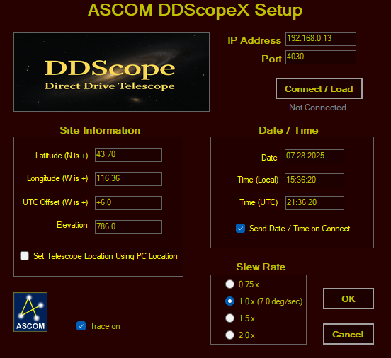

# ASCOM DDScopeX Telescope Driver

This repository contains source code and .exe for an **ASCOM-compatible Telescope driver** for 
the [DDScopeX](https://github.com/RichardBenear/DDScopeXv4_plugin_for_OnStepXv10.25 ) (Direct Drive TeleScope) telescope. 
It uses **TCP/IP communication** to connect to the DDScopeX firmware and hardware, 
enabling control from ASCOM clients such as Cartes du Ciel, Stellarium, and NINA.

This ASCOM driver was developed in C# with Visual Studio 2022 using the ASCOM 7 generator. 
A Setup Form provides the ability to connect and set or load some telescope parameters.

Since DDScopeX FW is a plugin to the base [OnStepX](https://github.com/hjd1964/OnStepX) FW, 
then it should work with other LX200 command protocol telescopes, 
expecially OnStepX FW-based ones, but has not been tested with them.

Since a wireless connection via TCP/IP is being used, then either the 
[DDScopeX LX200 Bridge](https://github.com/RichardBenear/LX200WifiBridge) 
or the OnStepX [Smart Web Server](https://github.com/hjd1964/SmartWebServer) is required. 

There exists an OnStepX ASCOM driver .exe [here](http://stellarjourney.com/?r=site/software_telescope), 
and it works with DDScopeX, but I wanted to develop my own to learn about ASCOM and with the possibility 
of extending the functionality in the future. Hopefully, this source code can be of help for other
ASCOM driver developers.

---

## Features
- TCP/IP connection to telescope controller 
- Set slewing at configurable speeds (0.75x, 1x, 1.5x, 2x)
- Get or Set Site Latitude, Longitude, and Elevation
- ASCOM Platform 6.5+ compatible 
- Optional setting of Telescope: Date, Time, and UTC Offset  
- Sync'ing
- Optional Trace Logging of messages

---
## ASCOM Methods Used
- AbortSlew
- AlignmentMode (Get)
- Declination (Get)
- RightAscension (Get)
- SiteElevation (Get) (Set)
- SiteLatitude (Get) (Set)
- SiteLongitude (Get) (Set)
- SlewToCoordinates
- SlewToCoordinatesAsync
- SlewToTarget
- SlewToTargetAsync
- SlewToAltAz
- SlewToAltAzAsync
- Slewing (Get)
- SyncToCoordinates
- SyncToTarget
- TargetDeclination (Set)
- TargetRightAscension (Set)
- Tracking (Get) (Set)

---  
## LX200 Command Support

- `:MS#` — Slew to coordinates / Slew to target  
- `:SG`, `:SC`, `:SL` — Set UTC offset, date, and time  
- `:St`, `:Sg`, `:Sv` — Set site latitude, longitude, and elevation  
- `:Gt`, `:Gg`, `:Gv` — Get site coordinates and elevation  
- `:GR#`, `:GD#` — Get RA and DEC  
- `:Sr`, `:Sd` - Set Target Right Ascension, Declination
- `:SX93,n` - Set Slew Rate
- `:Q#` - Abort Slew
- `:CM#` - Sync to target
- `:GT#`, `:Te`, `:Td` - Tracking Get, Enable, Disable

---

## Repository Structure
DDScopeX-ASCOM-Driver/  
├── DDScopeX.csproj  
├── TelescopeDriver.cs  
├── TelescopeHardware.cs  
├── SetupDialogForm.cs  
├── SetupDialogForm.Designer.cs  
├── Properties/  
│ └── AssemblyInfo.cs  
├── Installer/  
│  └── DDScopeX_ASCOM_Installer.iss  
├── LICENSE  
├── README.md  
└── ddscopex_screenshot.png  

---   

## Driver Screenshot

Below is a screenshot of the configuration Dialog Form for the DDScope ASCOM driver:

---  

## Installation

### 1. Requirements

- Windows 10 or later  
- [.NET Framework 4.8+](https://dotnet.microsoft.com/en-us/download/dotnet-framework)  
- [ASCOM Platform 6.5 or newer](https://ascom-standards.org/)  

### 2. Install the Driver

> If you've built the driver yourself, an installer `.exe` will have been generated using the ASCOM Developer Tools.

1. Run the `DDScope_ASCOM_Installer.exe`  
2. The installer will register the driver with the ASCOM platform.  
3. After installation, you can configure the driver via any ASCOM client.

---

## Setup & Configuration

1. Launch your ASCOM client (e.g., Stellarium, Cartes du Ciel, NINA).  
2. Select **DDScopeX Telescope** as your telescope driver.  
3. Click **Properties** to open the configuration dialog:
	- Set IP address and port, 
	- Check connection and load data with Connect / Load Button
	- If loaded Data from Telescope is not the preferred setting 
       -- Choose your preferred slew speed  
	   -- Set site coordinates and elevation if different than the loaded values
	- Optionally enable date/time synchronization to the Telescope 
	- Optionally turn on/off message logging for debug
4. Click **OK** to save the profile and close  

---

## OnStep 
[OnStep Group Wiki](https://groups.io/g/onstep/wiki/home)  

---

## License

This project is licensed under the MIT License. See [LICENSE](LICENSE.txt) for details.

---

## Author
Richard Benear 7/2025

---